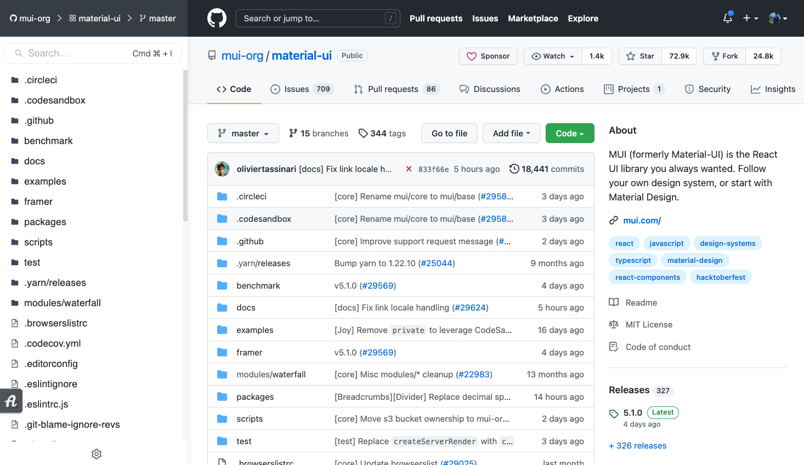
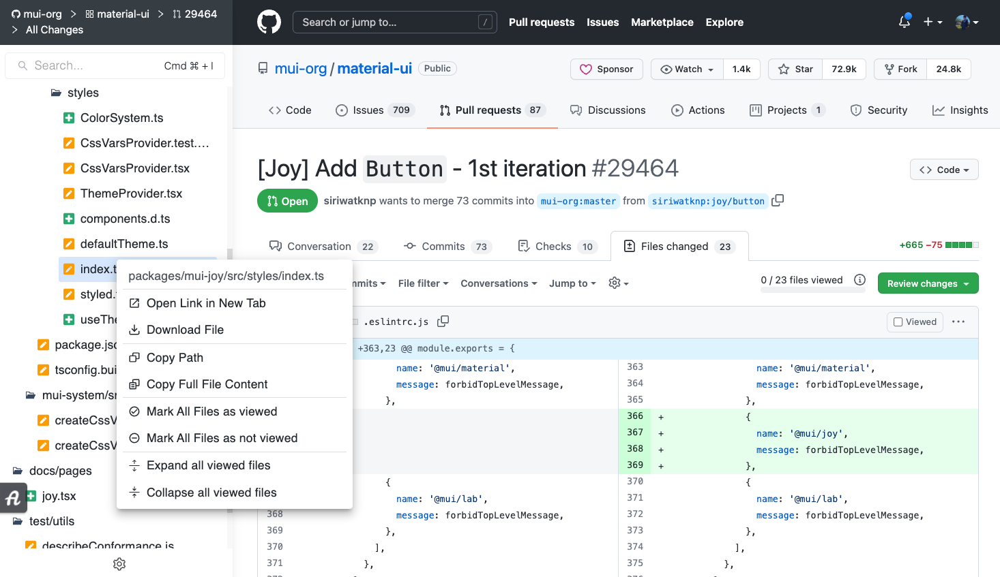
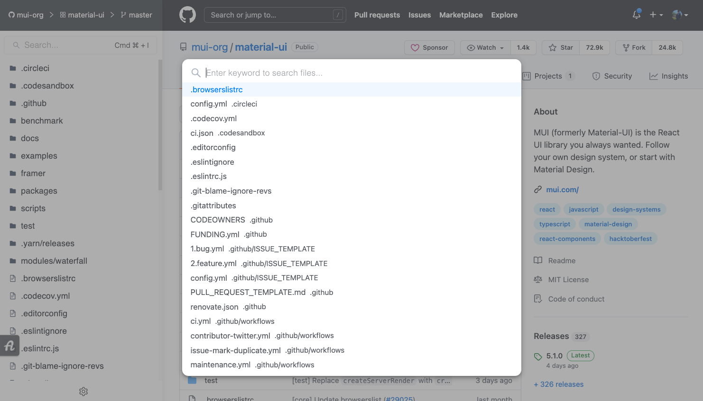
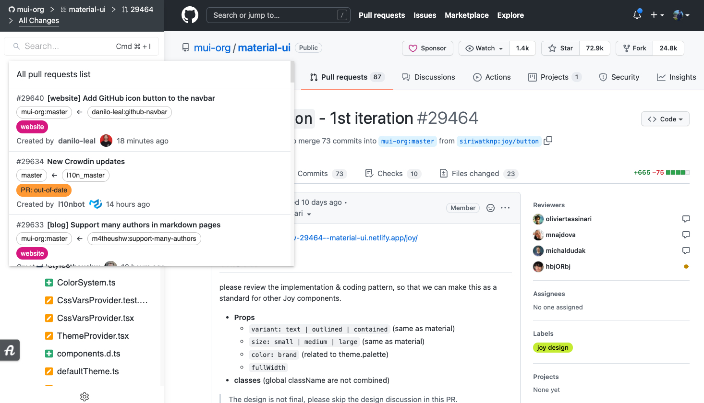
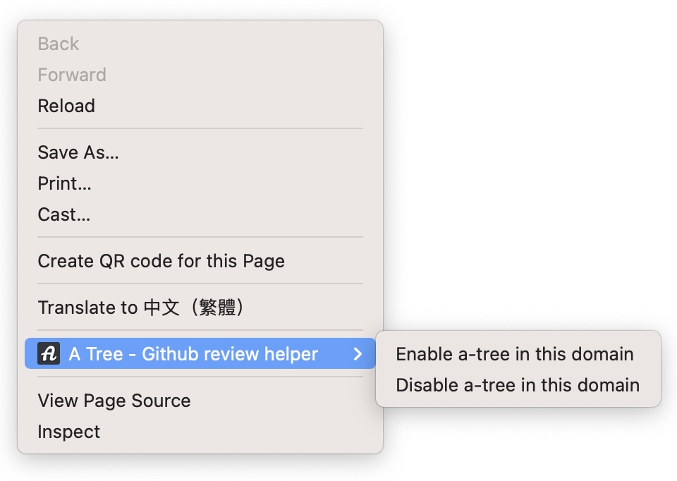

# A Tree - Github review helper

## :rocket: Quick Features
- Tree view for both Github files and pull requests
- Some handy tools for code review (collapse/expand files, mark all files as viewed, etc.)
- Quick search files like VSCode does (*`command + i` or `ctrl + i`*, customizable)
- Support SPA for Github Pages
- Support private and [Enterprise](https://github.com/shinenic/a-tree#fq) repositories

## :memo: About A-Tree

### Screenshots
| A tree preview | Open context menu to access files & toggle PR files |
|-------------------------------------------|---------------------------------------------------|
|  |  |

| Search files in both code & PR pages | Switch PR in a menu quickly |
|-------------------------------------------|---------------------------------------------------|
|  |  |                                  

### Permission requirements
- contextMenus

  For Github enterprise users, we provide a simple way to enable our extension via right click.


### F&Q

- How to enable extension for **Github Enterprise** pages

  After you install the extension, right-click on any Github Enterprise pages, then click the `Enable a-tree in this domain`.
  
  

- Why the extension shows in some unexpected pages

  If you encounter this problem, please help us improve our extension via creating [issues](https://github.com/shinenic/a-tree/issues/new/choose),
  it will be nice to have the `url` included.

- How to create personal access token
  
  1. Follow this [offcial guide](https://docs.github.com/en/github/authenticating-to-github/keeping-your-account-and-data-secure/creating-a-personal-access-token)
  2. Select `repo` checkbox
     
  3. Copy the token into the extension `SETTING`


- Why we need token
  
  1. To access private or enterprise repositories
  2. Github limits requests to 60/hours without `token`


- How to solve the `API rate limit exceeded` issue with enterprise account

  Please refer to the [official documentation](https://docs.github.com/en/authentication/authenticating-with-saml-single-sign-on)


- How to trace code in a more efficient way
  
  If you need to trace the code between files, we would recommend that use the **powerful built-in online VS Code in Github** (open via shortcut `.`)


## :computer: Development

### Setup
```shell=
git clone https://github.com/shinenic/a-tree.git
cd a-tree
yarn
```

### Develop with real online Github pages
```shell=
yarn dev
```
After the build finished, install the `/build` folder


### Develop in the local and dummy pages
1. Start mock API server via `Mockoon`

    a. With GUI
      Download [Mockoon](https://mockoon.com) and import the json for necessary APIs

    b. With command lines
      ```shell
        npm install -g @mockoon/cli

        yarn mockoon:start

        yarn mockoon:stop
      ```
      Default settings
        - port: `5567`
        - cors: `enable` (https://mockoon.com/docs/latest/cors/)

2. Start webpack server
    ```shell=
    yarn dev:local
    ```


### Build extension
```shell=
yarn build:prod
```

### Helper

Quick extension reload for development: [Extensions Reloader](https://chrome.google.com/webstore/detail/extensions-reloader/fimgfedafeadlieiabdeeaodndnlbhid)
> Note. Still need to reinstall the unpacked folder manually if `manifest.json` changed
